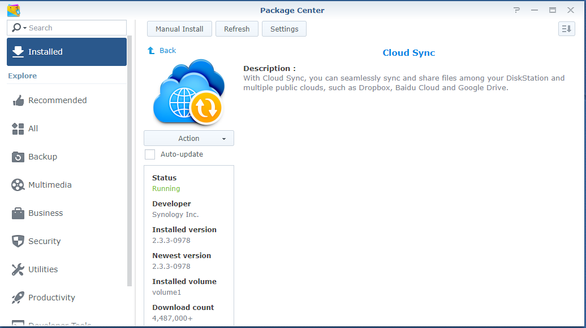
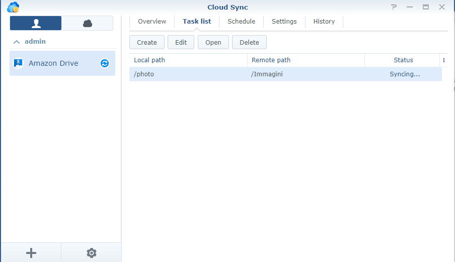
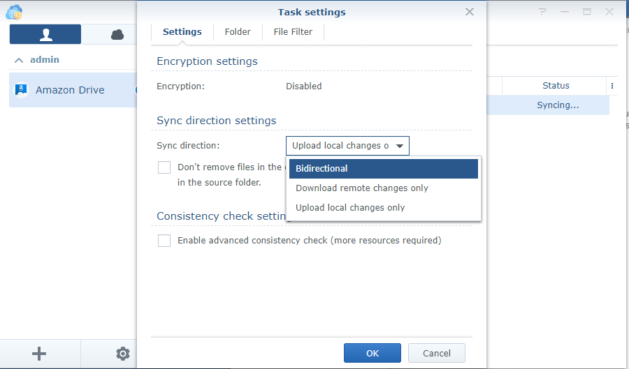
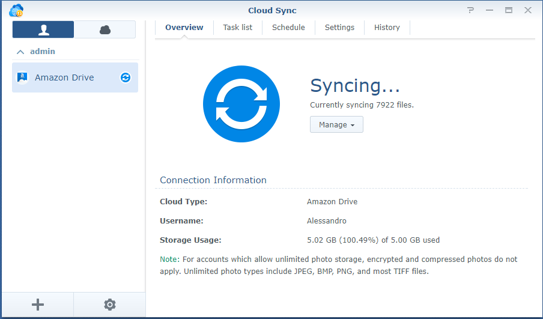

### Intro

Few weeks ago I discovered that Amazon gives an unlimited space on its [Amazon Photos] service for all Amazon Prime members. If you like photography and keep a backup of all your pics on this Amazon Drive follow these few lines where I'm gonna show what you need to do. The automation described is configured for a Synology NAS, but this could be easily triggered also on a QNAP or a Backup Server (easier with Linux but also on Windows can be done).

The interesting part is that there are no limitation for all photos formats: jpg, tiff,png, and even all image formats and all RAW formats (Canon, Nikon, Sony etc..). Personally I store more NEFs (Nikon's NEF) than JPEGs, so this sounded really good to me.

### How to configure it on a Synology DSM 6.x (also 5.x should be fine)

Synology provides an app called "Cloud Sync" which can be found on their **Package Center**.

Once installed you can easily configure a daily/weekly backup task which performs all checks and synchronization between your local folder containing images (on the NAS) and the Amazon Drive Foto. For example I have a Lightroom library on my Synology called /photo. On the amazon drive foto I found the /Immagini folder already created by amazon drive at first login. The only thing I had to do was to set this simple task. It copies from /photo to /Immagini.

If you click on the Edit button of the image above you can nicely define the Synchronization Direction:  Bidirectional, Download remote changes only, Upload local changes only.

I selected "Upload local changes only" since I want Amazon Drive as a carbon copy of the NAS, but that's just my choice, also bidirectional would be fine for copying data from NAS to Amazon Drive Foto and viceversa. What really surprised me it's that this service works even with RAW files, so it recognize all different raw files and allows you to store them on an unlimited cloud space. It's an awesome feature for all photographers and raw shooters!

[Amazon Photos]: https://www.amazon.it/b?_encoding=UTF8&%2AVersion%2A=1&%2Aentries%2A=0&node=12935593031